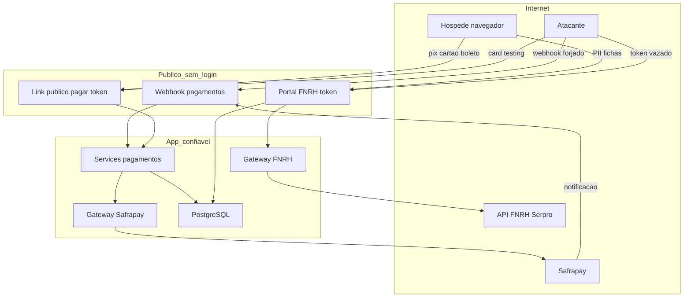

# Threat Model — Pagamentos + FNRH (CRM Vô Testa)

_AppSec threat model, ancorado no código. Escopo: `apps/pagamentos` (Safrapay, cobranças,
webhook, link público, captura de cartão) e FNRH (`apps/reservas/fnrh_gateway.py`,
`FichaFNRH`, portal de pré check-in). Gerado com a skill `security-threat-model`._

## Executive summary

O maior risco é o **webhook de pagamento sem verificação de autenticidade**
(`apps/pagamentos/views.py:webhook`, `@csrf_exempt`): ele confirma uma cobrança com base
apenas em `gateway_id` + `status` do corpo da requisição. Como os valores de status "pago"
são conhecidos (`paid`/`pago`/`captured`/`2`/`8`) e o `gateway_id` pode vazar, um atacante
capaz de descobrir um `gateway_id` consegue **forjar um webhook e confirmar reserva/cobrança
sem pagar**. Somam-se a isso: **captura de cartão pelo nosso servidor** sem rate limit
(escopo PCI + card testing), **portal FNRH público por token** dando leitura/escrita de PII
(CPF, nascimento, endereço) sem rate limit, e **persistência do corpo do webhook** (PII do
adquirente) em `EventoPagamento.detalhe`. A ausência de WAF/rate limiting (confirmada)
eleva todos os riscos de abuso automatizado.

## Scope and assumptions

**In-scope:** `apps/pagamentos/` (views, services, gateways, models), `apps/reservas/fnrh_gateway.py`,
`FichaFNRH` (em `apps/reservas/models.py`), `apps/portal/` (checkin/token), fluxo de cobrança do
site (`apps/site/views.py::_criar_cobranca_site`).

**Out-of-scope:** demais módulos do CRM (estoque, governança, etc.), infra Railway, o app
legado `Site_Vo_Testa`, CI/build.

**Assumptions (confirmadas com o dono):**
- Deploy Railway, single-tenant (uma pousada); site (`/`) e CRM (`/crm/`) expostos na internet.
- Webhook (`/crm/pagamentos/webhook/`) é público — a Safrapay precisa alcançá-lo.
- **Sem WAF/rate limiting** na frente dos endpoints públicos (Railway direto).
- **CRM multiusuário com papéis** — authz interna é relevante.
- Assinatura/HMAC do webhook Safrapay **ainda não confirmada** → TM-001 tratado como
  não-mitigável hoje; recomendação primária independe de HMAC.
- Hoje em `simulado`/HML; o risco de pagamento vira real ao ligar `PAGAMENTOS_GATEWAY=safrapay` em produção.

**Open questions que mudariam o ranking:**
1. A Safrapay assina o webhook (HMAC) ou publica IPs fixos? (habilita mitigação forte do TM-001)
2. O `gateway_id` real da Safrapay é exposto em alguma tela/URL/log acessível a não-operadores?
3. Haverá WAF/rate limiting antes do go-live?

## System model

### Primary components
- **Site público** (`apps/site`) — vitrine + fluxo de reserva; cria cobrança de sinal.
- **Pagamentos** (`apps/pagamentos`) — cobranças, gateway plugável (`simulado`/`safrapay`),
  webhook, link público de pagamento, captura de cartão.
- **Gateway Safrapay** (`gateways.py::GatewaySafrapay`) — HTTP para `payment-hml/payment.safrapay.com.br`.
- **Reservas/FNRH** (`fnrh_gateway.py`, `FichaFNRH`) — envio à API FNRH (Serpro) + fichas de PII.
- **Portal do hóspede** (`apps/portal`) — acesso público por token (pré check-in FNRH, conta).
- **PostgreSQL** — cobranças, eventos, fichas FNRH, reservas.

### Data flows and trust boundaries
- **Internet → Webhook** (`POST /crm/pagamentos/webhook/`): status de pagamento; HTTP; **sem auth, sem assinatura, csrf-exempt**; validação só de formato + fail-safe de status. **Fronteira mais crítica.**
- **Internet → Link público** (`GET/POST /crm/pagamentos/pagar/<token>`): token UUID; sem login; captura de **cartão (PAN/CVV)** no POST `/cartao/`; sem rate limit.
- **Internet → Portal FNRH** (`GET/POST /hospede/<token>/checkin/`): token UUID; sem login; **PII de todos os hóspedes** (CPF, nascimento, endereço, telefone, e-mail); sem rate limit.
- **Pagamentos → Safrapay** (HTTPS, Basic Auth via `SAFRAPAY_TOKEN`): PAN/CVV, valor, doc do titular; TLS; segredo em env.
- **Reservas → API FNRH** (HTTPS, Basic Auth): PII dos hóspedes; TLS; segredo em env.
- **App → PostgreSQL**: cobranças, `EventoPagamento.detalhe` (corpo bruto do webhook), fichas FNRH.

#### Diagram

## Assets and security objectives

| Asset | Por que importa | Objetivo (C/I/A) |
|---|---|---|
| Estado de pagamento da cobrança (`Cobranca.status`) | Confirma reserva e libera serviço; forjável = prejuízo financeiro | **I** |
| Dados de cartão em trânsito (PAN/CVV) | Fraude; escopo PCI-DSS | **C** |
| PII dos hóspedes (`FichaFNRH`: CPF, nascimento, endereço, contato) | LGPD; dano ao titular | **C, I** |
| `SAFRAPAY_TOKEN` / credenciais FNRH | Acesso à API de pagamento/registro | **C** |
| `EventoPagamento.detalhe` (corpo do webhook) | Pode conter PII do adquirente; trilha | **C, I** |
| Disponibilidade do webhook/link | Falha impede conciliação/venda | **A** |

## Attacker model

### Capabilities
- Atacante remoto anônimo: envia HTTP arbitrário aos endpoints públicos (webhook, pagar, portal), sem rate limit.
- Pode automatizar (brute-force de token, card testing, flood).
- Pode obter um `gateway_id`/`token` se vazar (URL compartilhada, referer, print, log, insider de baixo privilégio).
- Usuário interno de **baixo privilégio** (CRM multiusuário) com acesso a telas que exibam `gateway_id`.

### Non-capabilities
- Não adivinha UUID v4 por força bruta (espaço 122 bits) — vazamento é o vetor realista, não enumeração.
- Não quebra TLS nem lê segredos do env sem comprometer o host.
- Não intercepta o canal App↔Safrapay/FNRH (HTTPS).

## Entry points and attack surfaces

| Surface | Como é alcançada | Fronteira | Notas | Evidência |
|---|---|---|---|---|
| Webhook de pagamento | `POST /crm/pagamentos/webhook/` | Internet→App | csrf-exempt, sem assinatura | `apps/pagamentos/views.py:356` |
| Captura de cartão | `POST /crm/pagamentos/pagar/<token>/cartao/` | Internet→App→Safrapay | PAN/CVV pelo servidor; sem rate limit | `views.py:224 pagar_cartao` |
| Confirmar via "Já paguei" | `POST /crm/pagamentos/pagar/<token>/confirmar/` | Internet→App | consulta status real (fail-safe) | `views.py:265 pagar_simular` |
| Portal FNRH pré check-in | `GET/POST /hospede/<token>/checkin/` | Internet→App | leitura/escrita PII, sem rate limit | `apps/portal/views.py checkin` |
| Link público de pagamento | `GET /crm/pagamentos/pagar/<token>/` | Internet→App | expõe valor/descrição | `views.py:212 pagar` |

## Top abuse paths

1. **Webhook forjado → reserva grátis:** atacante descobre um `gateway_id` → `POST /webhook/` com `gateway_id=<id>&status=paid` → `confirmar_pagamento` → reserva confirmada / cobrança "paga" sem dinheiro. (TM-001)
2. **Card testing via nosso endpoint:** atacante com um `token` de cobrança de cartão → repetidos `POST .../cartao/` com PANs roubados → usa a resposta da Safrapay para validar cartões (BIN attack). Sem rate limit. (TM-002)
3. **Vazamento de token do portal → PII:** token do QR compartilhado por WhatsApp/foto/referer → `GET /hospede/<token>/checkin/` expõe CPF/endereço/contato de todos os hóspedes; `POST` adultera as fichas (dados falsos na FNRH oficial). (TM-003)
4. **PII em log/DB pelo webhook:** corpo bruto do webhook Safrapay (nome, doc, endereço do adquirente) persistido em `EventoPagamento.detalhe` → exposição ampliada (backups, quem lê a trilha). (TM-004)
5. **Insider de baixo privilégio lê `gateway_id`:** usuário interno sem alçada vê o `gateway_id` numa tela/detalhe → habilita TM-001 sem precisar de vazamento externo. (TM-005)
6. **DoS de conciliação:** flood no webhook cria `EventoPagamento` sem limite → inflar tabela/ruído na trilha, dificultando detecção. (TM-006)

## Threat model table

| ID | Fonte | Pré-requisitos | Ação | Impacto | Assets | Controles existentes (evidência) | Gaps | Mitigações recomendadas | Detecção | Likelihood | Severidade | Prioridade |
|---|---|---|---|---|---|---|---|---|---|---|---|---|
| TM-001 | Remoto anônimo | Conhecer um `gateway_id` válido | Forjar `POST /webhook` com status pago | Reserva confirmada sem pagamento; perda financeira | Estado de pagamento | Fail-safe: status ausente não confirma fora do sandbox; idempotência (`views.py:378`, `services.confirmar_pagamento`) | **Sem verificação de autenticidade/assinatura**; status "pago" é string conhecida | **Não confirmar pelo corpo do webhook**: usar o webhook só como gatilho e **confirmar sempre via `gw.consultar_status`** (fonte da verdade). Se Safrapay tiver HMAC/IP allowlist, exigir. Rejeitar corpo não assinado. | Alertar quando confirmação vem de webhook cujo `consultar_status` diverge; logar IP de origem | Média | Alta | **Crítica** |
| TM-002 | Remoto anônimo | Um `token` de cobrança de cartão | Repetir `POST .../cartao/` com PANs | Card testing/fraude; escopo PCI; bloqueio pela Safrapay | Dados de cartão | Token UUID; autorização delegada ao gateway | Sem rate limit; PAN transita pelo servidor | **Rate limit por token/IP**; **tokenização/checkout hospedado Safrapay** (tirar PAN do nosso servidor); CAPTCHA após N tentativas | Alertar em >N tentativas de cartão por token/IP | Média | Alta | **Alta** |
| TM-003 | Remoto anônimo | Token do portal vazado | `GET/POST /hospede/<token>/checkin/` | Exposição/adulteração de PII (LGPD) | PII hóspedes | Token UUID; `Http404` se módulo off/reserva inativa | Sem rate limit; token de longa vida; leitura+escrita ampla | Expirar/rotacionar token pós-estadia; rate limit; `Referrer-Policy: no-referrer`; considerar 2º fator leve (sobrenome+código, como em "minha reserva") | Log de acessos ao portal por token/IP | Média | Alta | **Alta** |
| TM-004 | Interno/backup | Acesso à trilha ou backup | Ler `EventoPagamento.detalhe` | Exposição de PII do adquirente | PII; trilha | Trilha auditável | Persiste corpo bruto (pode ter PII) | **Redigir/allowlist de campos** antes de gravar `detalhe`; nunca persistir PAN/CVV | Revisão periódica do conteúdo de `detalhe` | Média | Média | **Média** |
| TM-005 | Insider baixo priv. | Ver `gateway_id` numa tela | Reusar em TM-001 | Confirmação forjada interna | Estado de pagamento | Papéis no CRM | `gateway_id` pode aparecer a não-operadores | Restringir exibição de `gateway_id` por papel; a correção do TM-001 neutraliza o vetor | Auditar quem acessa detalhe de cobrança | Baixa | Alta | **Média** |
| TM-006 | Remoto anônimo | Nenhum | Flood no webhook/portal | Ruído na trilha; custo | Disponibilidade; trilha | — | Sem rate limit | Rate limit/WAF; cap de tamanho de corpo; dedupe de eventos | Métrica de volume de webhook/eventos | Média | Baixa | **Média** |

## Criticality calibration

- **Crítica (para este repo):** qualquer caminho que **confirme pagamento sem dinheiro** ou exponha **PAN/CVV** em massa. Ex.: TM-001; vazamento de `SAFRAPAY_TOKEN`; RCE pré-auth (não observado).
- **Alta:** exposição/adulteração de **PII de hóspedes** ou **card testing** via nossos endpoints. Ex.: TM-002, TM-003.
- **Média:** exposição parcial de PII via logs/trilha, abuso que degrada detecção, vetor que exige insider. Ex.: TM-004, TM-005, TM-006.
- **Baixa:** vazamento de dado de baixa sensibilidade (valor/descrição de uma cobrança pelo link).

## Focus paths for security review

| Path | Por que importa | Threat IDs |
|---|---|---|
| `apps/pagamentos/views.py` (`webhook`, `_extrair_webhook`, `_STATUS_PAGO`) | Confirmação sem autenticidade — corrigir para consultar_status/HMAC | TM-001, TM-006 |
| `apps/pagamentos/views.py::pagar_cartao` | PAN pelo servidor, sem rate limit; card testing | TM-002 |
| `apps/pagamentos/gateways.py` (`_criar_cartao`, `consultar_status`) | Manipula cartão e resposta persistida; base da correção do TM-001 | TM-001, TM-002, TM-004 |
| `apps/portal/views.py::checkin` + `apps/portal/models.py` (token) | Acesso público a PII sem rate limit / expiração | TM-003 |
| `apps/pagamentos/services.py` (`confirmar_pagamento`, `autorizar_cartao_online`, gravação de `detalhe`) | Ponto de confirmação e de persistência de PII | TM-001, TM-004 |
| `apps/reservas/fnrh_gateway.py` + `FichaFNRH` | PII enviada a terceiro; campos sensíveis | TM-003, TM-004 |

## Quality check
- ✅ Entry points cobertos: webhook, pagar, pagar/cartao, pagar/confirmar, portal checkin.
- ✅ Cada fronteira aparece em ≥1 ameaça (Internet→webhook/pagar/portal; App→Safrapay/FNRH; App→DB).
- ✅ Runtime vs CI/dev separados (CI/build fora de escopo).
- ✅ Clarificações do usuário refletidas (sem WAF, multiusuário, HMAC a confirmar).
- ✅ Suposições e perguntas abertas explícitas.

---

## Correções recomendadas — ordem de ataque

1. **TM-001 (crítica) — antes de ligar Safrapay em produção:** tornar o webhook **não-autoritativo**: ao receber, chamar `gw.consultar_status(cobranca)` e só confirmar se o **gateway** disser pago. Nunca confirmar a partir do `status` do corpo. Se a Safrapay tiver HMAC/IP allowlist, exigir também.
2. **TM-002 / TM-003 / TM-006 — rate limiting** nos 3 endpoints públicos (por IP+token) + cap de tamanho de corpo. (Sem WAF, fazer no app, ex.: `django-ratelimit`.)
3. **TM-003 — portal:** expirar token após check-out e `Referrer-Policy: no-referrer` no portal.
4. **TM-004 — redigir** o corpo do webhook antes de gravar `EventoPagamento.detalhe` (allowlist de campos; nunca PAN/CVV).
5. **PCI (médio prazo):** avaliar **tokenização/checkout hospedado** da Safrapay para tirar o PAN do nosso servidor (reduz escopo PCI e mata TM-002 na raiz).

### Status das correções

- ✅ **TM-001 (crítica) — CORRIGIDO.** Webhook agora é apenas gatilho: fora do sandbox,
  ignora o `status` do corpo e confirma **só** se `gw.consultar_status()` (fonte da verdade)
  disser pago. `apps/pagamentos/views.py::webhook`. Teste: webhook forjado com `status=paid`
  não confirma quando o provedor diz "pending" (`WebhookSegurancaTests`).
- ✅ **TM-002/003/006 (rate limit) — MITIGADO.** Util `apps/nucleo/ratelimit.py` (cache, sem
  dependência nova) aplicado a: webhook (60/min/IP), `pagar_cartao` (5/15min por token +
  15/h por IP), portal FNRH checkin (30/min/IP). Testes em `RateLimitTests`.
  _Ressalva: LocMemCache é por worker; para limite global em produção, usar cache
  compartilhado (Redis)._
- ✅ **TM-004 (médio) — CORRIGIDO.** O corpo do webhook é redigido antes de virar trilha:
  chaves sensíveis (card/cvv/cpf/name/email/address/customer…) viram `[REDACTED]`;
  ids/status/valores de reconciliação permanecem. `apps/pagamentos/views.py::_redigir`.
  Teste: PAN/CVV/documento não aparecem em `EventoPagamento.detalhe` (`RedacaoWebhookTests`).
- ✅ **TM-003 (alto) — MITIGADO.** Descoberto que o token **já morre pós-checkout** (as
  views exigem `reserva.ativa`/`estadia_ativa`) — comprovado por teste (home + FNRH → 404
  após check-out, `TokenPosCheckoutTests`). Somado: rate limit (feito) + `SECURE_REFERRER_POLICY
  = "same-origin"` explícito (não vaza token na URL via Referer cross-origin) + `@never_cache`.
- ⏳ **Pendentes (não bloqueiam go-live):** PCI/tokenização (TM-002 na raiz — tirar o PAN do
  nosso servidor via checkout hospedado Safrapay); confirmar HMAC/IP allowlist com a Safrapay
  (endureceria ainda mais o TM-001); cache compartilhado (Redis) para rate limit global.
